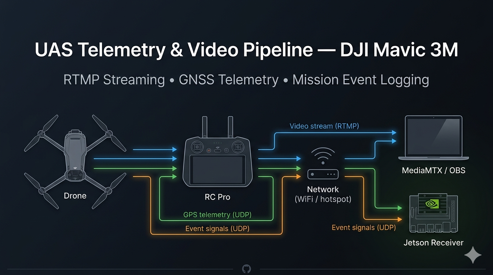

# 🛩️ UAS Telemetry & Video Pipeline

<div align="center">
  


**Real-time GNSS telemetry extraction, RTMP video streaming, and autonomous mission event signaling for precision UAV operations.**

*Smart Horticultural Systems Lab — Biosystems Engineering*

</div>

---

## 📋 Table of Contents

- [Overview](#-overview)
- [System Architecture](#-system-architecture)
- [Data Flow Pipelines](#-data-flow-pipelines)
- [Component Breakdown](#-component-breakdown)
- [Network Configuration](#-network-configuration)
- [Setup Instructions](#-setup-instructions)
  - [Ground Station (Mac)](#1-ground-station-mac)
  - [Edge Node (Jetson)](#2-edge-node-jetson)
  - [RC Pro Android App](#3-rc-pro-android-app)
  - [DJI Pilot 2 RTMP](#4-dji-pilot-2-rtmp-configuration)
- [Configuration Reference](#-configuration-reference)
- [Repository Structure](#-repository-structure)
- [Troubleshooting](#-troubleshooting)
- [Known Constraints](#-known-constraints)
- [Use Cases](#-use-cases)
- [System Requirements](#-system-requirements)
- [Future Improvements](#-future-improvements)
- [License](#-license)

---

## 🔍 Overview

This system implements a **multi-channel data pipeline** for the DJI Mavic 3M multispectral UAV platform. It decouples live video delivery, GNSS telemetry forwarding, and mission event detection into three independent, fault-tolerant pipelines — enabling synchronized ground station awareness without interfering with active waypoint missions.

### Key Capabilities

| Capability | Implementation |
|---|---|
| Live video monitoring | RTMP → MediaMTX → OBS Studio |
| GNSS telemetry forwarding | DJI SDK → UDP → Jetson |
| Mission row completion signaling | OBS file watcher → UDP → Jetson log |
| RTK-grade positioning | Emlid RS2+ hotspot network |
| Edge compute integration | NVIDIA Jetson (Ubuntu) |

---

## 🏗️ System Architecture

```
┌─────────────────────────────────────────────────────────────────┐
│                        AIRBORNE SEGMENT                         │
│                                                                 │
│   ┌──────────────────┐           ┌─────────────────────────┐   │
│   │  DJI Mavic 3M    │◄─────────►│    RC Pro Controller    │   │
│   │                  │  RC Link  │                         │   │
│   │  • SD Recording  │           │  • DJI Mobile SDK v5   │   │
│   │  • .SRT Telemetry│           │  • GPS UDP Forwarder   │   │
│   │  • GNSS @ 10Hz   │           │  • DJI Pilot 2 (RTMP) │   │
│   └──────────────────┘           └───────────┬─────────────┘   │
└───────────────────────────────────────────────│─────────────────┘
                                                │
                                    WiFi (Emlid RS2+ Hotspot)
                                                │
                              ┌─────────────────▼──────────────────┐
                              │           LOCAL NETWORK            │
                              │         10.42.0.0/24               │
                              │      (Emlid RS2+ Gateway)          │
                              └──────────┬────────────┬────────────┘
                                         │            │
                              ┌──────────▼───┐  ┌─────▼──────────────┐
                              │  Mac GCS     │  │   Jetson           │
                              │  10.42.0.105 │  │   10.42.0.211      │
                              │              │  │                    │
                              │  • MediaMTX  │  │  • UDP Receiver    │
                              │  • OBS Studio│  │  • Event Logger    │
                              │  • Row Alert │  │  • mission-signal/ │
                              └──────────────┘  └────────────────────┘
```

---

## 📡 Data Flow Pipelines

### Pipeline 1 — Video (RTMP)

```
Mavic 3M Camera
  └─► RC Pro (DJI Pilot 2 → Live Stream → Custom RTMP)
        └─► rtmp://10.42.0.105:1935/live
              └─► MediaMTX  (RTMP ingest + relay)
                    └─► OBS Studio  (monitor + record)
                          └─► ~/Movies/*.mov
```

### Pipeline 2 — GNSS Telemetry (UDP)

```
FlightControllerKey.KeyAircraftLocation3D
  └─► DJI Mobile SDK  (RC Pro Android App)
        └─► TelemetrySender.kt  (Coroutine @ 1 Hz)
              └─► UDP :5005 ──► Mac / Jetson
                                  └─► Python socket receiver
                                        └─► JSONL log
```

### Pipeline 3 — Mission Events (UDP)

```
OBS stops recording
  └─► New .mov file created in ~/Movies/
        └─► mac_row_notifier.py  (polls every 2s)
              └─► UDP :7000 ──► Jetson (10.42.0.211)
                                  └─► jetson_receiver.py
                                        └─► ~/mission-signal/log_YYYYMMDD.txt
```

---

## 🧩 Component Breakdown

| Component | Host | Language | Role |
|---|---|---|---|
| `TelemetrySender.kt` | RC Pro | Kotlin | Extracts GPS from DJI SDK, forwards via UDP at 1 Hz |
| `DJIAircraftMainActivity.kt` | RC Pro | Kotlin | App entry point, initializes telemetry sender |
| `mediamtx` | Mac | Go binary | RTMP ingest and relay server |
| `OBS Studio` | Mac | C++ | Live video monitoring and recording to disk |
| `mac_row_notifier.py` | Mac | Python 3 | Polls OBS output folder, fires row-complete UDP events |
| `jetson_receiver.py` | Jetson | Python 3 | UDP listener, persists mission events to timestamped log |

---

## 🌐 Network Configuration

### Device IPs

| Device | IP Address | Role |
|---|---|---|
| Emlid RS2+ | `10.42.0.1` | Hotspot gateway |
| Mac (Ground Station) | `10.42.0.105` | RTMP server, OBS, event dispatcher |
| Jetson (Edge Node) | `10.42.0.211` | UDP receiver, edge compute |
| RC Pro (Controller) | `10.42.0.x` | RTMP source, GPS forwarder |

### Port Map

| Service | Protocol | Port | Direction |
|---|---|---|---|
| RTMP video ingest | TCP | `1935` | RC Pro → Mac |
| GNSS telemetry | UDP | `5005` | RC Pro → Mac / Jetson |
| Row completion events | UDP | `7000` | Mac → Jetson |

---

## 🚀 Setup Instructions

### 1. Ground Station (Mac)

**Install dependencies:**
```bash
brew install ffmpeg mediamtx
brew install --cask obs
```

**Configure MediaMTX** — create `~/mediamtx.yml`:
```yaml
paths:
  live:
    source: publisher
```

**Start MediaMTX:**
```bash
mediamtx ~/mediamtx.yml
```

**Start row event notifier:**
```bash
python3 mac_row_notifier.py
```

**OBS Configuration:**
- `Sources` → `+` → `Media Source` → uncheck Local File
- Input: `rtmp://10.42.0.105:1935/live`
- `Settings` → `Output` → Recording Path: `/Users/<user>/Movies`
- Format: `.mov` or `.mp4`

---

### 2. Edge Node (Jetson)

**Transfer script from Mac:**
```bash
scp jetson_receiver.py <user>@10.42.0.211:~/
```

**Start receiver on Jetson:**
```bash
python3 ~/jetson_receiver.py
```

**Output location:**
```
~/mission-signal/log_YYYYMMDD.txt
```

Each log entry format:
```
[2026-04-11 17:23:45] FROM 10.42.0.105 | Row Complete | Row: 1 | File: 2026-04-11_17-23-40.mov | Time: 2026-04-11 17:23:45
```

---

### 3. RC Pro Android App

**Build in Android Studio:**
```
Project: Mobile-SDK-Android-V5/SampleCode-V5/android-sdk-v5-as
Module:  android-sdk-v5-sample
```

**Set DJI API key** in `gradle.properties`:
```properties
AIRCRAFT_API_KEY = <your_dji_api_key>
```

> ⚠️ API key must match the app package name registered at [developer.dji.com](https://developer.dji.com)

**Set target IP** in `TelemetrySender.kt`:
```kotlin
private const val MAC_IP   = "10.42.0.105"
private const val UDP_PORT = 5005
```

**Deploy to RC Pro via USB:**
```bash
adb devices        # confirm connection
# then Run from Android Studio
```

---

### 4. DJI Pilot 2 RTMP Configuration

```
DJI Pilot 2 → ··· → Live Stream → Custom RTMP

URL:        rtmp://10.42.0.105:1935/live
Resolution: 720P
FPS:        30
Bitrate:    1.5 Mbps (Adaptive)
```

> ℹ️ DJI Pilot 2 and the custom SDK app **cannot run simultaneously**. Use Pilot 2 for waypoint missions; use the SDK app for direct GPS telemetry extraction.

---

## ⚙️ Configuration Reference

```bash
# TelemetrySender.kt (RC Pro)
MAC_IP          = 10.42.0.105
UDP_PORT        = 5005
POLL_INTERVAL   = 1000 ms

# mac_row_notifier.py (Mac)
OBS_FOLDER      = /Users/<user>/Movies
JETSON_IP       = 10.42.0.211
JETSON_PORT     = 7000
CHECK_INTERVAL  = 2 s

# jetson_receiver.py (Jetson)
LISTEN_PORT     = 7000
SAVE_FOLDER     = ~/mission-signal/
```

---

## 📁 Repository Structure

```
uas-telemetry-pipeline/
│
├── android/
│   ├── TelemetrySender.kt            # GPS extraction + UDP forwarding
│   └── DJIAircraftMainActivity.kt    # App entry point
│
├── ground_station/
│   ├── mac_row_notifier.py           # OBS file watcher + UDP dispatcher
│   └── mediamtx.yml                  # MediaMTX RTMP server config
│
├── jetson/
│   └── jetson_receiver.py            # UDP event receiver + logger
│
└── README.md
```

---

## 🔧 Troubleshooting

| Symptom | Likely Cause | Fix |
|---|---|---|
| Waypoint mission crashes on launch | SDK blocking mission thread | Remove `startLiveStream()` from `TelemetrySender`; GPS-only mode has no conflict |
| OBS receives no RTMP stream | Wrong IP in Pilot 2 or MediaMTX path missing | Set URL to `rtmp://10.42.0.105:1935/live`; verify `paths.live` in `mediamtx.yml` |
| UDP packets sent but Jetson silent | Devices on different subnets | Confirm both on RS2 hotspot (`10.42.0.x`); run `ping 10.42.0.211` from Mac |
| GPS reads `0.0, 0.0` | SDK not registered or drone disconnected | Verify API key matches package name in DJI developer portal |
| Row notifier fires on existing files at startup | Script snapshots baseline on launch | Expected behavior — only new files after script start trigger events |
| `jetson_receiver.py` log file empty | File handle buffering | Script opens/closes file per message — ensure latest version is deployed |
| SCP connection refused | SSH not running on Jetson | Run: `sudo systemctl enable --now ssh` on Jetson |
| MediaMTX shows `path not configured` | Missing `paths` block in config | Add `paths: live: source: publisher` to `mediamtx.yml` |

---

## ⚠️ Known Constraints

- **Single app at a time on RC Pro** — DJI Pilot 2 and the custom SDK app cannot run simultaneously. GPS extraction requires the SDK app; autonomous waypoint missions require Pilot 2.
- **RTMP stream quality ceiling** — Practical limit is 720P/30FPS/1.5Mbps over RS2 hotspot. Full-resolution footage is always available on the drone's onboard SD card.
- **GPS forward rate** — SDK telemetry forwarded at 1 Hz via polling. Higher rates (up to 10 Hz) are achievable using DJI key-value subscription listeners.
- **Post-flight SRT correlation** — When running Pilot 2, GPS-video alignment must be done post-flight using the `.SRT` telemetry files saved alongside SD card footage.

---

## 🌾 Use Cases

| Domain | Application |
|---|---|
| **Precision Agriculture** | Row-by-row multispectral capture with per-row video and GPS archiving |
| **Infrastructure Inspection** | Segment-tagged video of transmission lines, pipelines, or bridges |
| **Research Deployments** | Time-synced telemetry and video for UAV flight dynamics studies |
| **Ground Truth Collection** | RTK-grade GPS correlation with camera frames for ML dataset labeling |
| **Crop Monitoring** | Automated NDVI pass logging with spatial georeferencing |

---

## 💻 System Requirements

| Component | Requirement |
|---|---|
| DJI Mavic 3M firmware | v07.01.10.06+ |
| RC Pro firmware | v03.00.00.09+ |
| Android (RC Pro) | API Level 24+ |
| DJI Mobile SDK | v5.9.0 |
| macOS | Ventura 13+ |
| Jetson (JetPack) | 5.x / Ubuntu 20.04+ |
| Python | 3.10+ |
| FFmpeg | 6.0+ |
| MediaMTX | v1.x |
| OBS Studio | 30.x+ |

---

## 🔮 Future Improvements

- [ ] Replace 2-second polling in `mac_row_notifier.py` with `watchdog` FSEvents for zero-latency detection
- [ ] Integrate Emlid RS2+ NMEA TCP stream for RTK-corrected coordinates alongside DJI SDK GPS
- [ ] Post-flight `.SRT` parser to auto-correlate SD card video segments with `.KMZ` waypoint boundaries
- [ ] WebSocket real-time dashboard for telemetry visualization on ground station
- [ ] Docker container for `jetson_receiver.py` with `systemd` auto-start on boot
- [ ] Automatic `.KMZ` ingestion to pre-load waypoint coordinates for per-segment GPS labeling
- [ ] Bi-directional event bus (Jetson → Mac) for adaptive mission control feedback

---

## 📄 License

MIT License. See [`LICENSE`](LICENSE) for details.

---

<div align="center">

*Smart Horticultural Systems Lab — Biosystems Engineering*

</div>
